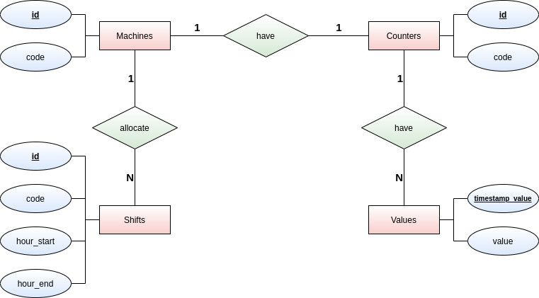

# PackIOT FSC :: Database

<!-- TOC -->
## 0. Table of contents

- [1. Introduction](#1-introduction)
- [2. Modelling](#2-modelling)
- [3. Implementation](#3-implementation)
    - [3.1. Creating tables](#31-creating-tables)
    - [3.2. Loading data](#32-loading-data)
    - [3.3. Production reports](#33-production-reports)
    - [3.4. Code linting](#34-code-linting)
        - [3.4.1. Linting](#341-linting)
        - [3.4.2. Fixing](#342-fixing)
- [4. Possible improvements](#4-possible-improvements)
- [5. Where to now?](#5-where-to-now)
    
<!-- /TOC -->
## 1. Introduction

In the context of a hypothetical factory floor, the scope of the challenge is to build a database structure that is capable of storing the number of parts produced, by different machines.

The following are the business domain requirements, associated to the features that this persistence layer must have:

* Each machine has **one** counter to store the production of parts to support reports by period;
* Each machine has **one or more** shifts working per day, starting and ending everyday at the **same time**, on **all days** of the week;
* Counter value is incremental on the source. A new value is added to the table every one minute. So, for each counter, the respective table has the reading on the source for the respective time when it was read, which can be higher than the previous value, or not, if there was no change;
* Counter can be reset back to zero at any time at the source and we do not have control over it;
* Due to the behavior on the pipeline connecting the source to the database, a counter reading might not arrive sorted by timestamp, which means, you can expect to receive readings that are older than the most recent reading for a given counter.
## 2. Modelling

With the specification in hand, we can now go to the entity modelling stage. The result of this is representated below by an entity-relationship diagram (ERD), in a more conceptual form, using [Chen's notation](https://en.wikipedia.org/wiki/Entity%E2%80%93relationship_model):



## 3. Implementation

Before going straight to the implementation aspects, is presented below an alternative version of the previous ERD, with emphasis to the physical structure of the tables that will compose the database:


Note that the types of each attribute are in accordance with the SQL type system that the PostgreSQL v11 supports.

Concerning implementation, some SQL scripts were implemented in order build the database structure:

* [ddl-stmts](./postgresql/scripts/sql/ddl-stmts.sql): This file contains the data definition (DDL) statements, i.e., the SQL statements responsible for creating the tables and its relations;
* [dml-stmts](./postgresql/scripts/sql/dml-stmts.sql): Regarding data manipulation (DML) statements, this file contains the implementation of functions that dymamically load data into the tables.
* [queries](./postgresql/scripts/sql/queries.sql): One of the required features in this project is to implement a query that evaluates the **total production** of parts, per **date**, **machine** and **shift**. The SQL abtraction for this query was implemented in the function `total_production()`.

Similar to the building process described at the root documentation, the creation of tables and loading of test data can be performed by the `devenv.py` script:

### 3.1. Creating tables
Just run on the terminal:
```bash
$ ./scripts/devenv.py db create tables
```

### 3.2. Loading data
In order to test the production report query, you must generate some dummy data. For that, just run in the terminal:
```bash
$ ./scripts/devenv.py db load data
```

### 3.3. Production reports
Just run on the terminal:
```bash
$ ./scripts/devenv.py db create queries
```

Having run all scripts, you can now check the newly created structure and test the queries via pgAdmin 4. More information [here](../README.md#22-pgadmin-4).

### 3.4. Code linting

In order to maintain a reasonable level of quality in code production, a SQL linting tool was integrated to the project ([SQLFluff](https://docs.sqlfluff.com/en/stable/)). It can be executed via the automation script.

#### 3.4.1. Linting
To just lint the code, and receive a report with possible inconsistencies, just run:
```bash
$ ./scripts/devenv.py code sql lint
```
#### 3.4.2. Fixing
To rectify possible format problems in the scripts, just run in the terminal:
```bash
$ ./scripts/devenv.py code sql fix
```

## 4. Possible improvements

* Concerning the storage of values for each counter, I believe that indexing the rows with a `timestamptz` could be problematic in the following scenario: Suppose that two count values are generated, each one for different counters, **at the same time** (with the same timestamp). Thus, when these records are stored in the database, an **index collision** will occur, generating a constraint error.
    * One possible solution for this is to index these records with some sort of [time-based UUID](https://www.postgresql.org/docs/current/uuid-ossp.html).
    * A composite primary key can also solve this problem, i.e., adding a `SERIAL` typed field (`id`) and redefining the primary key definition:
    ```sql
    CREATE TABLE values (
        ...
        id SERIAL,
        PRIMARY KEY (timestamp_value, id)
    );
    ```
## 5. Where to now?

* [Root](../README.md)
* [Scripts](../scripts/README.md) 
* [Table of contents](#0-table-of-contents)